```{r setup, include = FALSE}
knitr::opts_chunk$set(
  collapse = TRUE,
  comment = "#>"
)
```

## Introduction

RIdeogram is a R package to draw SVG (Scalable Vector Graphics) graphics to visualize and map genome-wide data on idiograms. 

## Citation

If you use this package in a published paper, please cite this paper:

Zhaodong Hao, Dekang Lv, Ying Ge, Jisen Shi, Dolf Weijers, Guangchuang Yu, and Jinhui Chen (2019). RIdeogram: Drawing SVG graphics to visualize and map genome-wide data on idiograms. R package version 0.2.0.

## Usage and Examples

This is a simple package with only three functions `ideogram`, `convertSVG` and `GFFex`.

First, you need to load the package after you installed it.

```{r}
require(RIdeogram)
```

Then, you need to load the data from the RIdeogram package.

```{r}
data(human_karyotype, package="RIdeogram")
data(gene_density, package="RIdeogram")
data(Random_RNAs_500, package="RIdeogram")
```

You can use the function "head()" to see the data format.

```{r}
head(human_karyotype)
```

Specifically, the 'karyotype' file contains the karyotype information and has five columns (or three, see below). The first column is Chromosome ID, the second and thrid columns are start and end positions of corresponding chromosomes and the fourth and fifth columns are start and end positions of corresponding centromeres.

```{r}
head(gene_density)
```

The 'mydata' file contains the heatmap information and has four columns. The first column is Chromosome ID, the second and thrid columns are start and end positions of windows in corresponding chromosomes and the fourth column is a characteristic value in corresponding windows, such as gene number.

```{r}
head(Random_RNAs_500)
```

The 'mydata_interval' file contains the label information and has six columns. The first column is the label type, the second column is the shape of label with three available options of box, triangle and circle, the third column is Chromosome ID, the fourth and fifth columns are the start and end positions of corresponding labels in the chromosomes and the sixth column is the color of the label.

Or, you can also load your own data by using the function `read.table`, such as

```r
human_karyotype <- read.table("karyotype.txt", sep = "\t", header = T, stringsAsFactors = F)
gene_density <- read.table("data_1.txt", sep = "\t", header = T, stringsAsFactors = F)
Random_RNAs_500 <- read.table("data_2.txt", sep = "\t", header = T, stringsAsFactors = F)
```

The "karyotype.txt" file contains karyotype information; the "data_1.txt" file contains heatmap data; the "data_2.txt" contains track label data.

In addition, we also provide a simple function `GFFex` for the heatmap information (like gene density) extraction from a GFF file. First, you need to download the GFF file of one species genome, for example, human genome annotation file from GENCODE (ftp://ftp.ebi.ac.uk/pub/databases/gencode/Gencode_human/release_32/gencode.v32.annotation.gff3.gz). Then, you need to prepare the karyotype file with the format same as the one mentioned above. The only thing you need to notice is that the chromosome ID at the first column in the karyotype file must be the same as that in the gff file (in this case, like chr1, chr2,...). Next, you can run the following code:

```r
gene_density <- GFFex(input = "gencode.v32.annotation.gff3.gz", karyotype = "human_karyotype.txt", feature = "gene", window = 1000000)
```
You can use the argument "feature" (default value is "gene") to select the feature you want to extract from the GFF file and the argument "window" (default value is "1000000") to set the window size.

Now, you can visualize these information using the `ideogram` function.

Basic usage

```r
ideogram(karyotype, overlaid = NULL, label = NULL, label_type = NULL, synteny = NULL, colorset1, colorset2, width, Lx, Ly, output = "chromosome.svg")
convertSVG(svg, device, width, height, dpi)
```

Now, let's begin.

First, we draw a idiogram with no mapping data.

```r
ideogram(karyotype = human_karyotype)
convertSVG("chromosome.svg", device = "png")
```

Then, you will find a SVG file and a PNG file in your Working Directory.

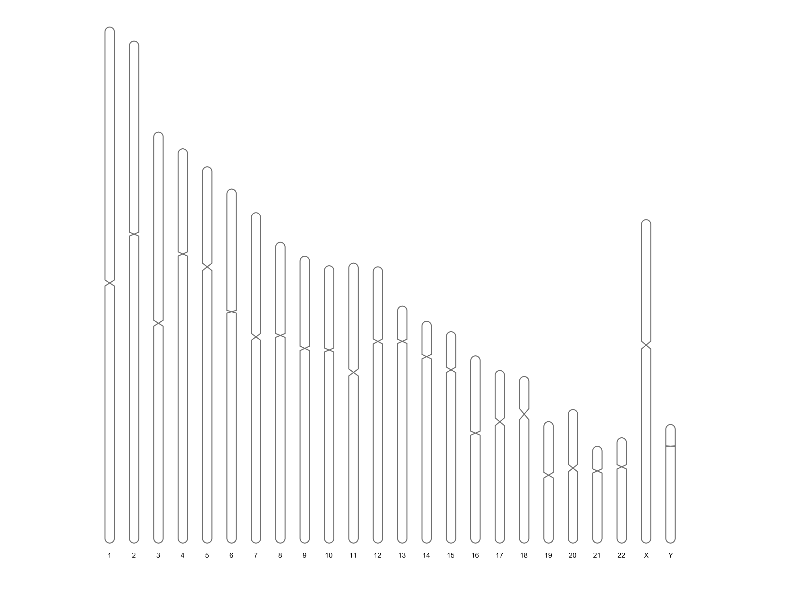

Next, we can map genome-wide data on the chromosome idiogram. In this case, we visulize the gene density across the human genome.

```r
ideogram(karyotype = human_karyotype, overlaid = gene_density)
convertSVG("chromosome.svg", device = "png")
```

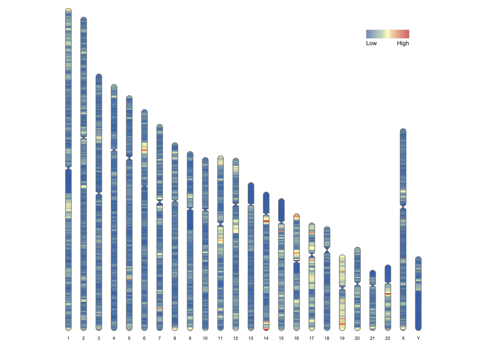

Alternatively, we can map some genome-wide data with track labels next to the chromosome idiograms.

```r
ideogram(karyotype = human_karyotype, label = Random_RNAs_500, label_type = "marker")
convertSVG("chromosome.svg", device = "png")
```


We can also map the overlaid heatmap and track labels on the chromosome idiograms at the same time.

```r
ideogram(karyotype = human_karyotype, overlaid = gene_density, label = Random_RNAs_500, label_type = "marker")
convertSVG("chromosome.svg", device = "png")
```


If you want to change the color of heatmap, you can modify the argument 'colorset1' (default set is colorset1 = c("#4575b4", "#ffffbf", "#d73027")). You can use either color names as listed by `colors()` or hexadecimal strings of the form "#rrggbb" or "#rrggbbaa".

```r
ideogram(karyotype = human_karyotype, overlaid = gene_density, label = Random_RNAs_500, label_type = "marker", colorset1 = c("#fc8d59", "#ffffbf", "#91bfdb"))
convertSVG("chromosome.svg", device = "png")
```

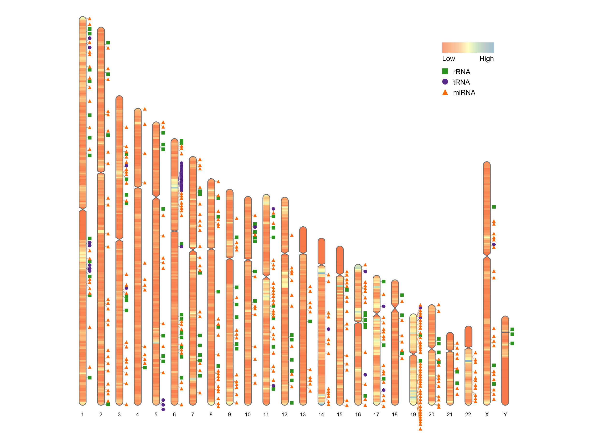

If you don not know the centromere information in your species, you don not need to modify the script. In this case, the 'karyotype' file has only three columns.

To simulate this case, we deleted the last two columns of the 'human_karyotype' file.

```r
human_karyotype <- human_karyotype[,1:3]
ideogram(karyotype = human_karyotype, overlaid = gene_density, label = Random_RNAs_500, label_type = "marker")
convertSVG("chromosome.svg", device = "png")
```


If there are only ten chromosomes in your species, maybe you need to motify the argument 'width' (default value is "170").

To simulate this case, we only keep the first ten columns of the 'human_karyotype' file.

Before
```r
human_karyotype <- human_karyotype[1:10,]
ideogram(karyotype = human_karyotype, overlaid = gene_density, label = Random_RNAs_500, label_type = "marker")
convertSVG("chromosome.svg", device = "png")
```


After
```r
human_karyotype <- human_karyotype[1:10,]
ideogram(karyotype = human_karyotype, overlaid = gene_density, label = Random_RNAs_500, label_type = "marker", width = 100)
convertSVG("chromosome.svg", device = "png")
```

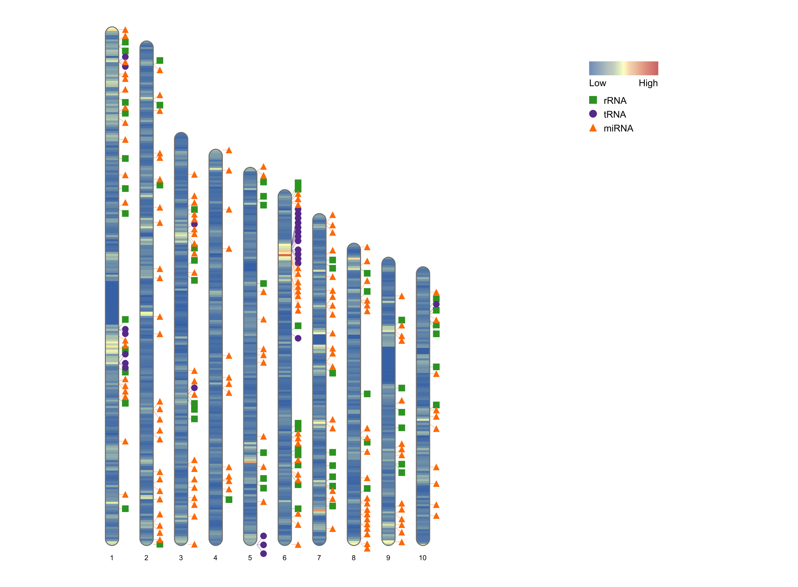

If you want to move the Legend, then you need to modify the arguments 'Lx' and 'Ly'(default values are "160" and "35", separately).

'Lx' means the distance between upper-left point of the Legend and the left margin; 'Ly' means the distance between upper-left point of the Legend and the upper margin.

```r
ideogram(karyotype = human_karyotype, overlaid = gene_density, label = Random_RNAs_500, label_type = "marker", width = 100, Lx = 80, Ly = 25)
convertSVG("chromosome.svg", device = "png")
```

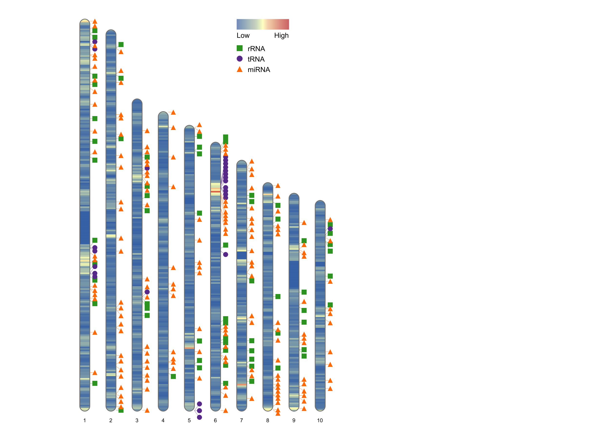

We also provide other types of label, like "heatmap", "line" and "polygon". For heatmap label, you can use the following scripts to map and visualize these data on idiograms.

```r
data(human_karyotype, package="RIdeogram") #reload the karyotype data
ideogram(karyotype = human_karyotype, overlaid = gene_density, label = LTR_density, label_type = "heatmap", colorset1 = c("#f7f7f7", "#e34a33"), colorset2 = c("#f7f7f7", "#2c7fb8")) #use the arguments 'colorset1' and 'colorset2' to set the colors for gene and LTR heatmaps, separately.
convertSVG("chromosome.svg", device = "png")
```


For one-line label, 
```{r}
data(liriodendron_karyotype, package="RIdeogram") #load the karyotype data
data(Fst_between_CE_and_CW, package="RIdeogram") #load the Fst data for overlaid heatmap
data(Pi_for_CE, package="RIdeogram") #load the Pi data for one-line label
head(Pi_for_CE) #this data has a similar format with the heatmap data with additional column of "Color" which indicate the color for the line.
```

```r
ideogram(karyotype = liriodendron_karyotype, overlaid = Fst_between_CE_and_CW, label = Pi_for_CE, label_type = "line", colorset1 = c("#e5f5f9", "#99d8c9", "#2ca25f"))
convertSVG("chromosome.svg", device = "png")
```

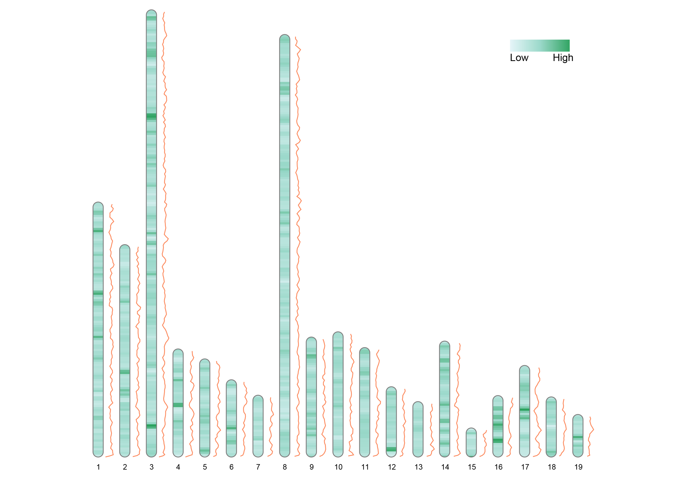

For two-line label, 
```{r}
data(liriodendron_karyotype, package="RIdeogram") #load the karyotype data
data(Fst_between_CE_and_CW, package="RIdeogram") #load the Fst data for overlaid heatmap
data(Pi_for_CE_and_CW, package="RIdeogram") #load the Pi data for two-line label
head(Pi_for_CE_and_CW) #this data has a similar format with the one for one-line label with additional two columns indicating the second feature you want to show. When you prepare your own data, please keep the exact same column names.
```

```r
ideogram(karyotype = liriodendron_karyotype, overlaid = Fst_between_CE_and_CW, label = Pi_for_CE_and_CW, label_type = "line", colorset1 = c("#e5f5f9", "#99d8c9", "#2ca25f"))
convertSVG("chromosome.svg", device = "png")
```

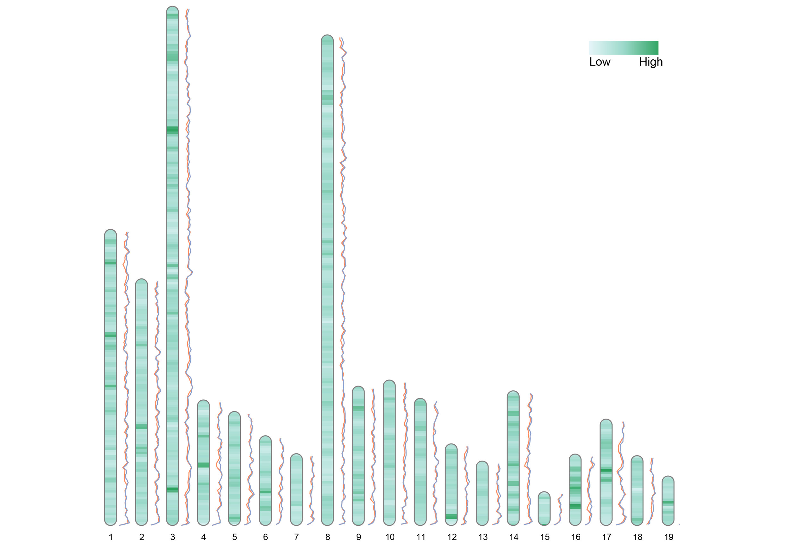

For one-polygon label, 
```r
data(liriodendron_karyotype, package="RIdeogram") #load the karyotype data
data(Fst_between_CE_and_CW, package="RIdeogram") #load the Fst data for overlaid heatmap
data(Pi_for_CE, package="RIdeogram") #load the Pi data for one-polygon label
ideogram(karyotype = liriodendron_karyotype, overlaid = Fst_between_CE_and_CW, label = Pi_for_CE, label_type = "polygon", colorset1 = c("#e5f5f9", "#99d8c9", "#2ca25f"))
convertSVG("chromosome.svg", device = "png")
```

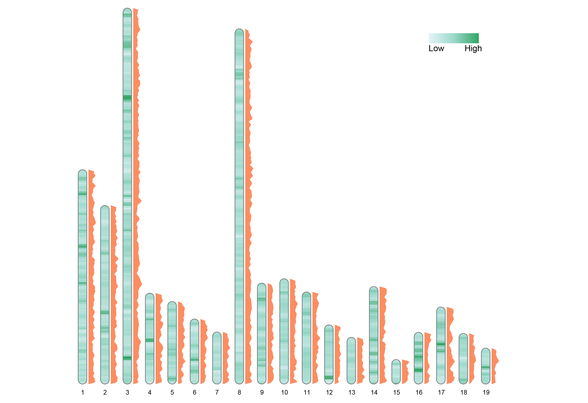

For two-polygon label, 
```r
data(liriodendron_karyotype, package="RIdeogram") #load the karyotype data
data(Fst_between_CE_and_CW, package="RIdeogram") #load the Fst data for overlaid heatmap
data(Pi_for_CE_and_CW, package="RIdeogram") #load the Pi data for two-polygon label
ideogram(karyotype = liriodendron_karyotype, overlaid = Fst_between_CE_and_CW, label = Pi_for_CE_and_CW, label_type = "polygon", colorset1 = c("#e5f5f9", "#99d8c9", "#2ca25f"))
convertSVG("chromosome.svg", device = "png")
```

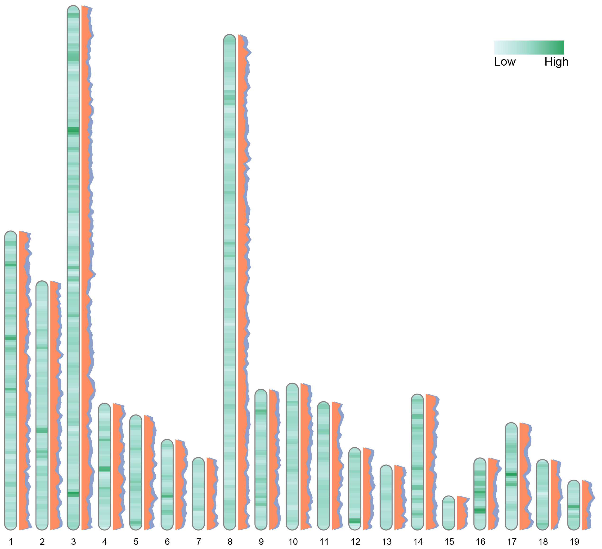

Comparing with the two-line label plot, we shift all x coordinates of the second polygon labels to right with a 0.2X chromosome width for better visualization.

In addition, you can use the argument "device" (default value is "png")to set the format of output file, such as, "tiff", "pdf", "jpg", etc. And, you can use the argument "dpi" (default value is "300") to set the resolution of the output image file.

```r
convertSVG("chromosome.svg", device = "tiff", dpi = 600)
```

Also, there are four shortcuts to convert the SVG images to these optional image formats with no necessary to set the argument "device", such as
```r
svg2tiff("chromosome.svg")
svg2pdf("chromosome.svg")
svg2jpg("chromosome.svg")
svg2png("chromosome.svg")
```

For genome synteny analysis, we can use the `ideogram` function to visualize the genome synteny results between two or three genomes.

For dual genome comparison, load the example data first,
```{r}
data(karyotype_dual_comparison, package="RIdeogram")
head(karyotype_dual_comparison)
table(karyotype_dual_comparison$species)

data(synteny_dual_comparison, package="RIdeogram")
head(karyotype_dual_comparison)
```

If you want to import your own data, using `read.table` function as mentioned above. One thing you need to notice is that the format of karyotype for genome synteny visualization is a little bit different:
First three columns are the same, the fourth is the color you want to fill the idiograms, the fifth is the name of species, the rest two columns are the size and color of species name. This karyotype file contains information of two genomes (species A: Grape and species B: Populus) with species A being sorted to the front.
And, for dual genome synteny file: the first three columns are position information in species A (Grape) and the next three columns are position information in species B (Populus) of corresponding synteny blocks, the last column is the color of the bezier curves which link corresponding synteny blocks. Please sort the colourful lines to the last as possiable as you can.

Then, run the code as folloing

```r
ideogram(karyotype = karyotype_dual_comparison, synteny = synteny_dual_comparison)
convertSVG("chromosome.svg", device = "png")
```

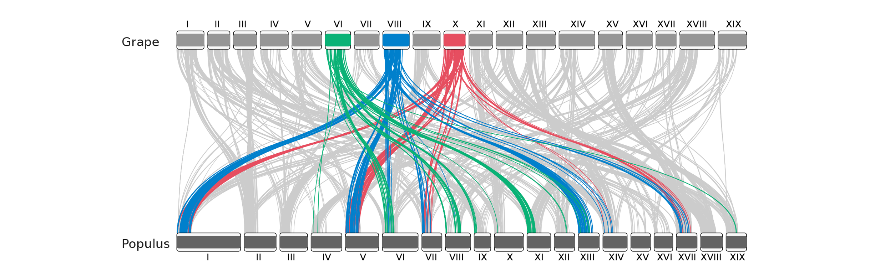

For ternary genome comparison, load the example data first,
```{r}
data(karyotype_ternary_comparison, package="RIdeogram")
head(karyotype_ternary_comparison)
table(karyotype_ternary_comparison$species)

data(synteny_ternary_comparison, package="RIdeogram")
head(synteny_ternary_comparison)
tail(synteny_ternary_comparison, n = 20)
```

The format of karyotype file for ternary genome synteny visualization is similar to that of dual genome syteny visualization, containing one more species karyotype information and being sorted in the order of species A (Amborella), B (Grape) and C (Liriodendron). However, the synteny file is different from that of dual genome syteny visualization. Because this synteny file contains three comparisons, i.e., species A_vs_B, species A_vs_C and species B_vs_C, we add one additional column with the number "1" being representative of the species A_vs_B, "2" being representative of the species A_vs_C and "3" being representative of the species B_vs_C. Also, please sort the colourful lines to the last as possiable as you can.

Then, run the code as following

```r
ideogram(karyotype = karyotype_ternary_comparison, synteny = synteny_ternary_comparison)
convertSVG("chromosome.svg", device = "png")
```

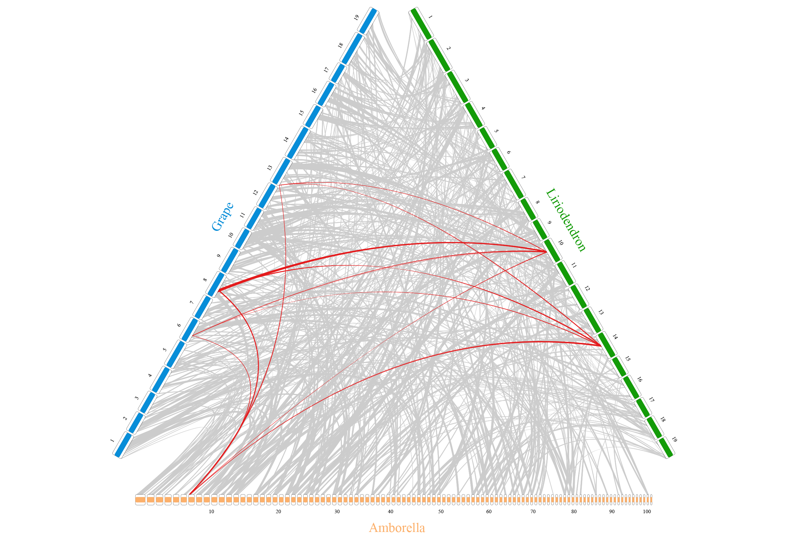

In addition, if you want use gradient color for the bezier curves which you want to highlighted (red lines in the above picture), just replace the red color "e41a1c" with "gradient" in the seventh column (as like in the example data of "synteny_ternary_comparison_graident"). Here, we first load the example data and visualize the ternary genome syteny using `ideogram` function. And since R graphics does not support the SVG element of gradient fill, we use the `rsvg_pdf` function from rsvg package to convert this svg file into a pdf file directly. So, maybe you need to install the rsvg package if you want to show the gradient fill or you can also open the svg file with Inkscape and then save as a pdf file.

```r
data(synteny_ternary_comparison_graident, package="RIdeogram")
ideogram(karyotype = karyotype_ternary_comparison, synteny = synteny_ternary_comparison_graident)
library("rsvg")
rsvg_pdf("chromosome.svg", "chromosome.pdf")
```
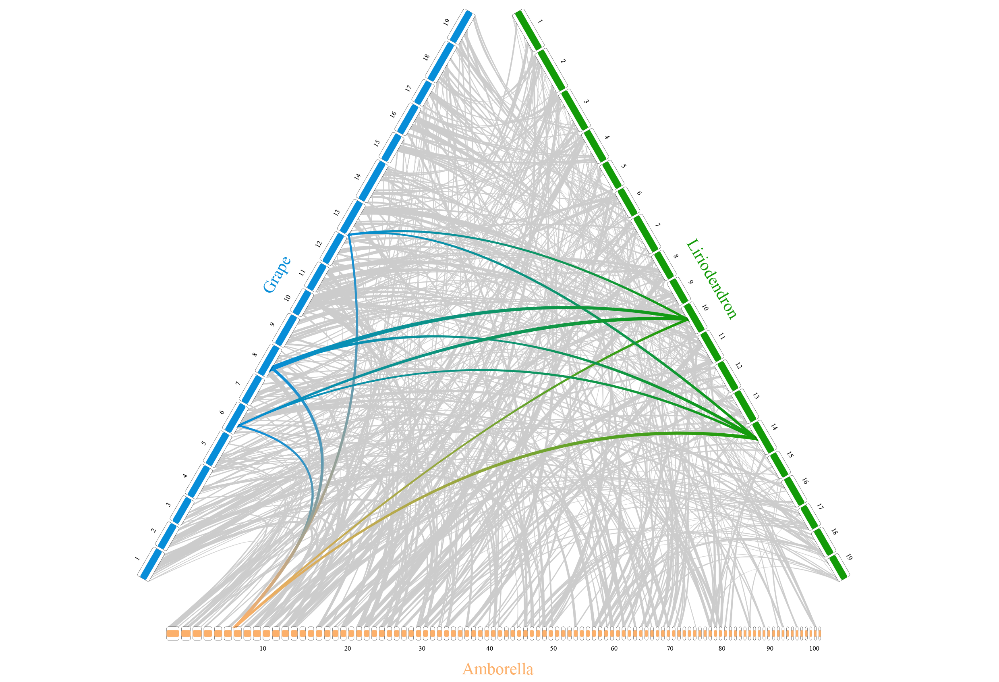
